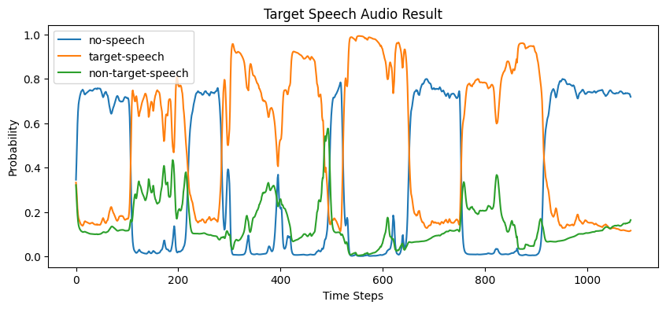
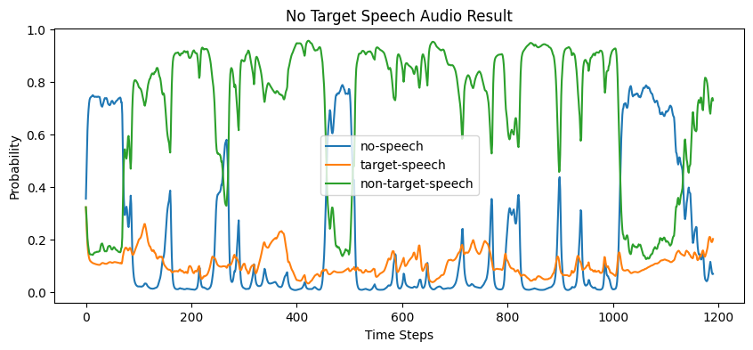

# Test Results





### See [ipynb notebook](inference.ipynb)

# SSL-PVAD
A repository for code used to produce the results the ICASSP 2024 paper: "SELF-SUPERVISED PRETRAINING FOR ROBUST PERSONALIZED VOICE ACTIVITY DETECTION IN ADVERSE CONDITIONS" 

## Installing packages used in project
The packages used in this project can be installed by running:
```
pip install -r requirements.txt
```

## Data preparation
To create the data sets used in this study run:
```
python data_preprocessing/prepare_data_librispeech_concat.py 
--conf configs/data_preparation/librispeech_concat_config.yaml
--generate_utterances
--generate_embeddings
--unique 
```

Here, you will need to update the configuration file with your data paths.

The script automatically downloads the LibriSpeech data used to generate the multi-speaker utterances, 
so make sure you have enough disk space before you run it.

## Running experiments
To run the experiments, simply run 
```
python <train_script_name> --conf <path_to_config>
```
E.g.,
```
python train_APC --conf configs/APC/LSTM_D64L2_APC_pretrain_960h_config_100_epoch.yaml
```

Examples of configs are found in the `configs`folder.
